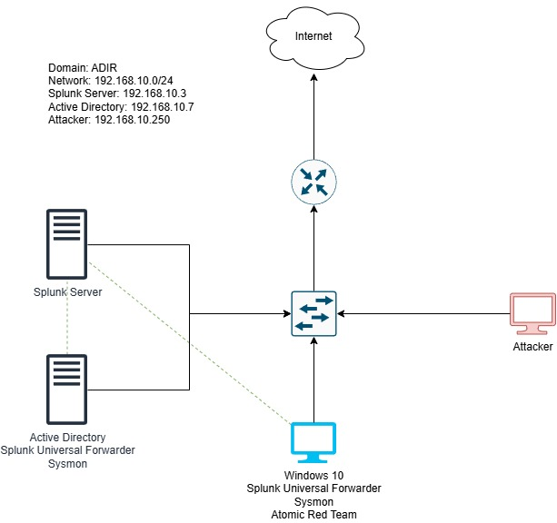
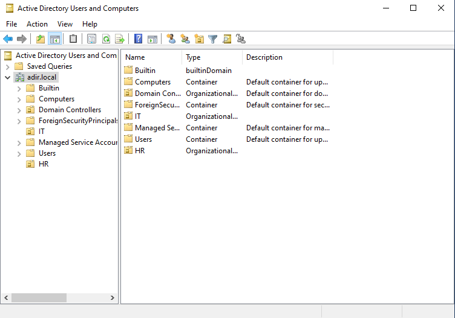
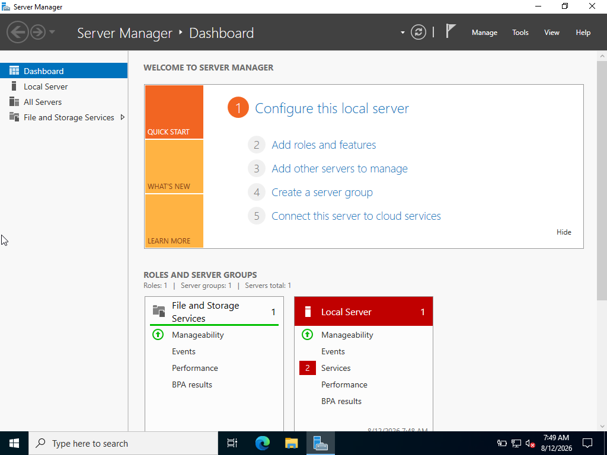
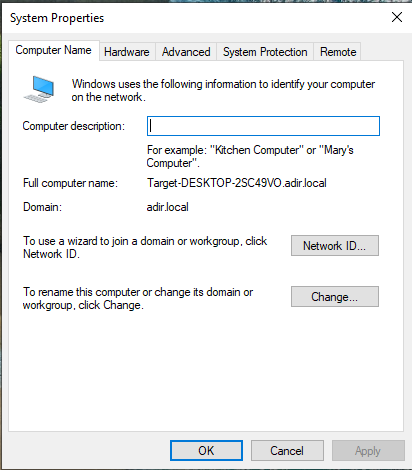
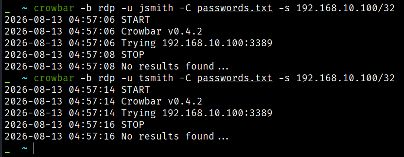
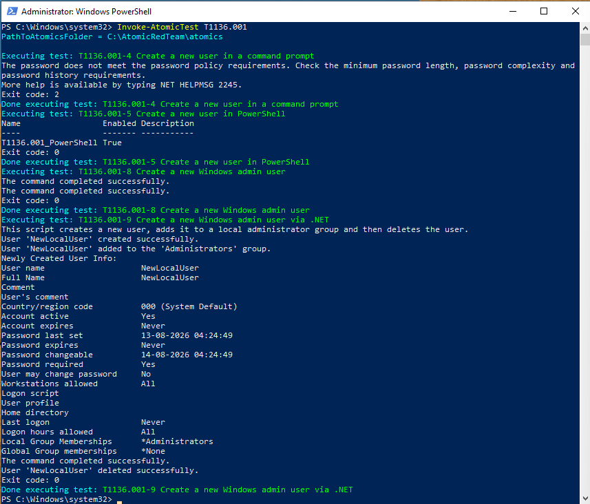
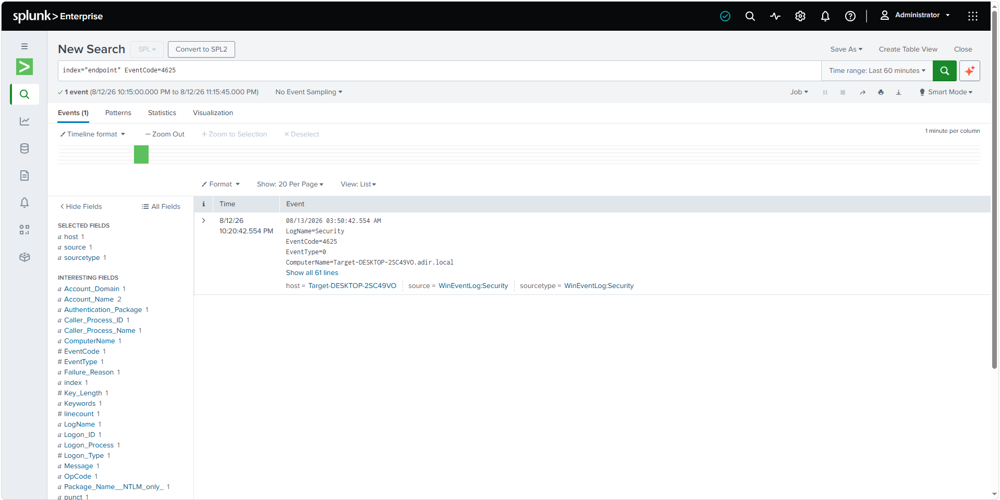

# Active Directory Incident Response Lab

[](https://microsoft.com)
[](https://splunk.com)
[](https://learn.microsoft.com/en-us/sysinternals/downloads/sysmon)
[](https://atomicredteam.io)
[](https://kali.org)

An end-to-end Active Directory lab built to simulate real-world adversary TTPs, capture telemetry via Sysmon and Windows Event Logs and perform threat hunting using Splunk Enterprise.

---

## Network & Lab Architecture

The lab consists of an isolated Active Directory domain (`adir.local`) mapped across a `192.168.10.0/24` subnet. Centralized log aggregation is handled by Splunk Universal Forwarders shipping event telemetry directly to a dedicated Splunk Enterprise indexer.



### Subnet & VM Configurations
| Host Role | OS / Software Stack | IP Address | Configured Telemetry |
| :--- | :--- | :--- | :--- |
| **Domain Controller** | Windows Server 2022 (AD DS, DNS) | `192.168.10.7` | Sysmon + Splunk Universal Forwarder |
| **Splunk Server** | Ubuntu Server 22.04 (Splunk Enterprise) | `192.168.10.3` | Centralized Indexer (`index=endpoint`) |
| **Target Workstation** | Windows 10 Pro | `192.168.10.100` | Sysmon + Splunk Universal Forwarder + Atomic Red Team |
| **Attacker Machine** | Kali Linux | `192.168.10.250` | Crowbar |

---

## Environment Provisioning & Domain Setup

### 1. Active Directory Organizational Structure
Configured standard enterprise Organizational Units (`IT`, `HR`) and populated user accounts.



### 2. Domain Infrastructure & Client Onboarding
Promoted Windows Server to primary Domain Controller for `adir.local` and joined the target Windows 10 workstation (`Target-DESKTOP-2SC49VO`).

| Domain Controller Setup | Client Domain Join Verification |
| :---: | :---: |
|  |  |

---

## Adversary Emulation & Attack Execution

### 1. RDP Brute-Force
Simulated unauthenticated external access attacks targeting domain user accounts (`jsmith`, `tsmith`) over Remote Desktop Protocol (Port 3389) using `Crowbar` on Kali Linux.



### 2. Automated Account Creation
Executed MITRE ATT&CK **T1136.001 (Persistence: Local Account Creation)** using `Invoke-AtomicTest` inside PowerShell to simulate administrative privilege abuse.



---

## Threat Hunting & Telemetry Analysis

### Hunt 1: RDP Brute-Force Detection
* **Objective:** Detect failed login attempts indicative of brute-force.
* **SPL Query:**
```spl
index="endpoint" EventCode=4625
```


### Hunt 2: Local Account Creation Detection
* **Objective:** Detect local account creation indicative of persistence.
* **SPL Query:**
```spl
index="endpoint" "NewLocalUser"
```

